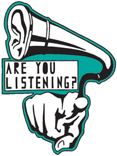

### How To Declare an Event Listener

Thank you for visiting this brief tutorial. We will cover how to initiate an event and begin to listen more!

<h4>Preparation </h4> You will need a working development environment with a text editor like Atom or Sublime. You will need to build a directory containing an html index file and CSS style sheet. You will also link a JavaScript file to your index file.

An event is described as any recorded action a user takes initiates when on your page.
In some cases the user will trigger the event and in other cases it will be triggered by the browser.
 jQuery makes it easier to set up event-driven responses on page elements.


<h4>Initiation </h4>
At this time you choose which event you would like to track and initiate them on user action like a click or hover.
Other events can also be triggered by a browser such as a timer or .ready function to initialize a page load.

To specify to the browser what to do when an event occurs, you provide a function, also known as an event handler.
This function is executed whenever the event occurs.




<h4> Example Code </h4>

Create a new event on Click

```
$( "input" ).on(
    "click",   
    function() {
        console.log( "An input was clicked" );
    }
);
```

You can use this code to create Multiple Events on the same handler.

```
$( "input" ).on(
    "click change",   // Bind handlers for multiple events. Separate with a space //
    function() {
        console.log( "An input was clicked or changed!" );
    }
);
```
You can use this code to create a new event on page load.

```
// This function is called when the user arrives at the page
// They have arrived
$(document).ready(function( ) {

}
```
Prevent page default
```  
//

$(element).on("click", function(event ) {

    // Prevent the elements default submission.//

    event.preventDefault();

    // Log the event object//

    console.log(event);

});
```

<h4> Listen </h4>

Monitor your results and data to derive meaning. Asses strengths in performance and areas for improvement or easier use.
There are many ways to listen for events. Actions are constantly occurring on a webpage, but the developer is only notified about them if they're listening for them. Listening for an event basically means you're waiting for the browser to tell you that a specific event has occurred and then you'll specify how the page should react.

<h4> Links </h4>

Credit to the jQuery Learning Center: <br>
https://learn.jquery.com/events/introduction-to-events/ <br>
https://learn.jquery.com/events/event-basics/
